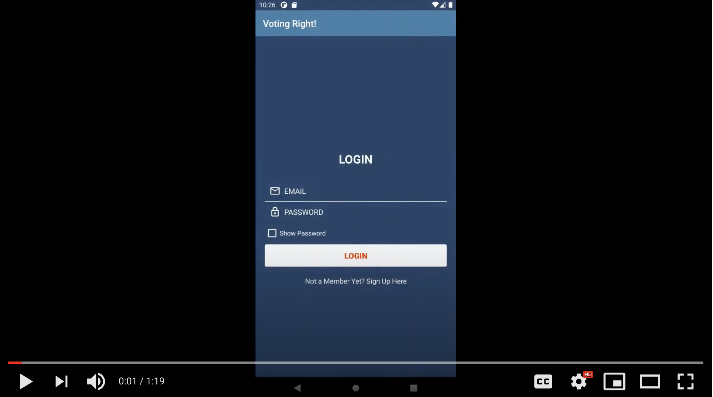

# votEasy
##### A.K.A VotingRights!

An Android application that connects users to upcoming elections within the area. Our purpose is to encourage users to vote in order to combat low-voter turnout and participation. 

### Tools used
- *Google's Civic Information API*: Used to retrieve elections and polling places based on the user's address
- *Firebase*: Used for user signup/login & Authentication

### Future Work
We plan to refine and expand on our current product by:
- [ ] improving the User Interface 
- [ ] allowing users to add elections to a Google Calendar
- [ ] implementing an in-app notification feature

### Demo 

### Team Members: 
- [Jenni Faust](https://github.com/jennifaust)
- [Tia Valakuzhy](https://github.com/tvalakuzhy)
- [Anusha Nambiar](https://github.com/anambiar7200)
- [Jennifer Lopez](https://github.com/Jen-Lopez)
- [Simran Sidhu](https://github.com/narmis99)

###### Developed for the Rewriting the Code *Rewrite Your Summer* Program &copy;2020
